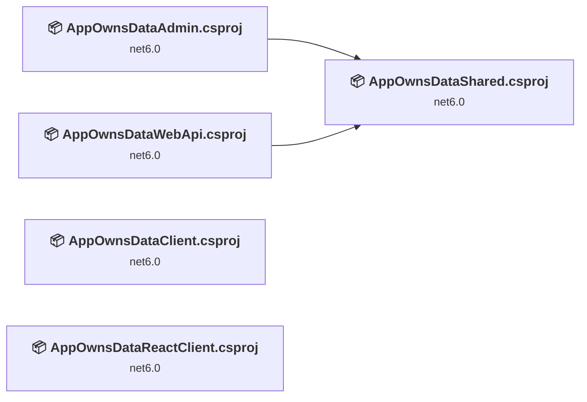
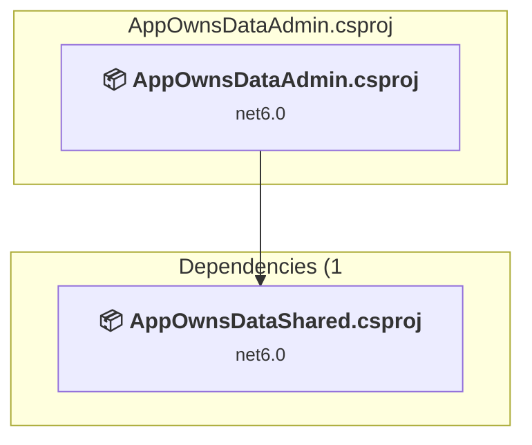
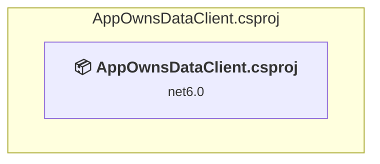
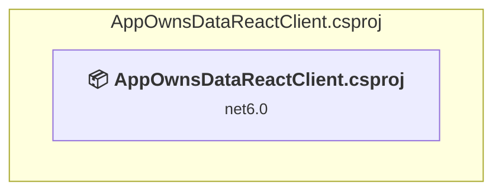
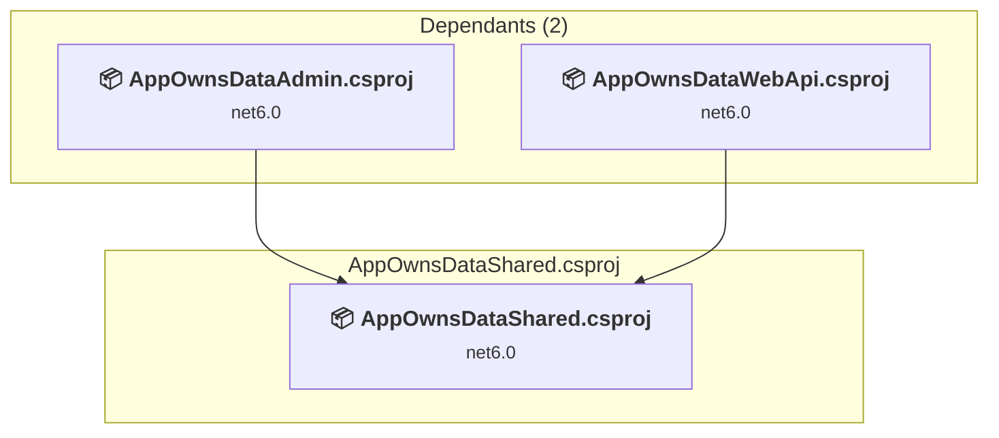

# Projects and dependencies analysis

This document provides a comprehensive overview of the projects and their dependencies in the context of upgrading to .NETCoreApp,Version=v10.0.

## Table of Contents

- [Executive Summary](#executive-Summary)
  - [Highlevel Metrics](#highlevel-metrics)
  - [Projects Compatibility](#projects-compatibility)
  - [Package Compatibility](#package-compatibility)
  - [API Compatibility](#api-compatibility)
- [Aggregate NuGet packages details](#aggregate-nuget-packages-details)
- [Top API Migration Challenges](#top-api-migration-challenges)
  - [Technologies and Features](#technologies-and-features)
  - [Most Frequent API Issues](#most-frequent-api-issues)
- [Projects Relationship Graph](#projects-relationship-graph)
- [Project Details](#project-details)

  - [AppOwnsDataAdmin\AppOwnsDataAdmin.csproj](#appownsdataadminappownsdataadmincsproj)
  - [AppOwnsDataClient\AppOwnsDataClient.csproj](#appownsdataclientappownsdataclientcsproj)
  - [AppOwnsDataReactClient\AppOwnsDataReactClient.csproj](#appownsdatareactclientappownsdatareactclientcsproj)
  - [AppOwnsDataShared\AppOwnsDataShared.csproj](#appownsdatasharedappownsdatasharedcsproj)
  - [AppOwnsDataWebApi\AppOwnsDataWebApi.csproj](#appownsdatawebapiappownsdatawebapicsproj)

## Executive Summary

### Highlevel Metrics

| Metric | Count | Status |
| :--- | :---: | :--- |
| Total Projects | 5 | All require upgrade |
| Total NuGet Packages | 24 | 21 need upgrade |
| Total Code Files | 46 |  |
| Total Code Files with Incidents | 10 |  |
| Total Lines of Code | 3948 |  |
| Total Number of Issues | 41 |  |
| Estimated LOC to modify | 15+ | at least 0.4% of codebase |

### Projects Compatibility

| Project | Target Framework | Difficulty | Package Issues | API Issues | Est. LOC Impact | Description |
| :--- | :---: | :---: | :---: | :---: | :---: | :--- |
| [AppOwnsDataAdmin\AppOwnsDataAdmin.csproj](#appownsdataadminappownsdataadmincsproj) | net6.0 | 🟢 Low | 5 | 5 | 5+ | AspNetCore, Sdk Style = True |
| [AppOwnsDataClient\AppOwnsDataClient.csproj](#appownsdataclientappownsdataclientcsproj) | net6.0 | 🟢 Low | 0 | 1 | 1+ | AspNetCore, Sdk Style = True |
| [AppOwnsDataReactClient\AppOwnsDataReactClient.csproj](#appownsdatareactclientappownsdatareactclientcsproj) | net6.0 | 🟢 Low | 1 | 5 | 5+ | AspNetCore, Sdk Style = True |
| [AppOwnsDataShared\AppOwnsDataShared.csproj](#appownsdatasharedappownsdatasharedcsproj) | net6.0 | 🟢 Low | 5 | 0 |  | ClassLibrary, Sdk Style = True |
| [AppOwnsDataWebApi\AppOwnsDataWebApi.csproj](#appownsdatawebapiappownsdatawebapicsproj) | net6.0 | 🟢 Low | 10 | 4 | 4+ | AspNetCore, Sdk Style = True |

### Package Compatibility

| Status | Count | Percentage |
| :--- | :---: | :---: |
| ✅ Compatible | 3 | 12.5% |
| ⚠️ Incompatible | 4 | 16.7% |
| 🔄 Upgrade Recommended | 17 | 70.8% |
| ***Total NuGet Packages*** | ***24*** | ***100%*** |

### API Compatibility

| Category | Count | Impact |
| :--- | :---: | :--- |
| 🔴 Binary Incompatible | 0 | High - Require code changes |
| 🟡 Source Incompatible | 5 | Medium - Needs re-compilation and potential conflicting API error fixing |
| 🔵 Behavioral change | 10 | Low - Behavioral changes that may require testing at runtime |
| ✅ Compatible | 8595 |  |
| ***Total APIs Analyzed*** | ***8610*** |  |

## Aggregate NuGet packages details

| Package | Current Version | Suggested Version | Projects | Description |
| :--- | :---: | :---: | :--- | :--- |
| Microsoft.AspNetCore.Authentication.JwtBearer | 6.0.4 | 10.0.5 | [AppOwnsDataAdmin.csproj](#appownsdataadminappownsdataadmincsproj) | NuGet package upgrade is recommended |
| Microsoft.AspNetCore.Authentication.JwtBearer | 6.0.8 | 10.0.5 | [AppOwnsDataWebApi.csproj](#appownsdatawebapiappownsdatawebapicsproj) | NuGet package upgrade is recommended |
| Microsoft.AspNetCore.Authentication.OpenIdConnect | 6.0.4 | 10.0.5 | [AppOwnsDataAdmin.csproj](#appownsdataadminappownsdataadmincsproj) | NuGet package upgrade is recommended |
| Microsoft.AspNetCore.Authentication.OpenIdConnect | 6.0.8 | 10.0.5 | [AppOwnsDataWebApi.csproj](#appownsdatawebapiappownsdatawebapicsproj) | NuGet package upgrade is recommended |
| Microsoft.AspNetCore.SpaServices.Extensions | 6.0.5 | 10.0.5 | [AppOwnsDataReactClient.csproj](#appownsdatareactclientappownsdatareactclientcsproj) | NuGet package upgrade is recommended |
| Microsoft.EntityFrameworkCore | 6.0.4 | 10.0.5 | [AppOwnsDataShared.csproj](#appownsdatasharedappownsdatasharedcsproj) | NuGet package upgrade is recommended |
| Microsoft.EntityFrameworkCore | 6.0.8 | 10.0.5 | [AppOwnsDataWebApi.csproj](#appownsdatawebapiappownsdatawebapicsproj) | NuGet package upgrade is recommended |
| Microsoft.EntityFrameworkCore.Design | 6.0.4 | 10.0.5 | [AppOwnsDataAdmin.csproj](#appownsdataadminappownsdataadmincsproj) | NuGet package upgrade is recommended |
| Microsoft.EntityFrameworkCore.Sqlite | 6.0.8 | 10.0.5 | [AppOwnsDataWebApi.csproj](#appownsdatawebapiappownsdatawebapicsproj) | NuGet package upgrade is recommended |
| Microsoft.EntityFrameworkCore.SqlServer | 6.0.4 | 10.0.5 | [AppOwnsDataShared.csproj](#appownsdatasharedappownsdatasharedcsproj) | NuGet package upgrade is recommended |
| Microsoft.EntityFrameworkCore.SqlServer | 6.0.8 | 10.0.5 | [AppOwnsDataWebApi.csproj](#appownsdatawebapiappownsdatawebapicsproj) | NuGet package upgrade is recommended |
| Microsoft.EntityFrameworkCore.Tools | 6.0.4 | 10.0.5 | [AppOwnsDataShared.csproj](#appownsdatasharedappownsdatasharedcsproj) | NuGet package upgrade is recommended |
| Microsoft.EntityFrameworkCore.Tools | 6.0.8 | 10.0.5 | [AppOwnsDataWebApi.csproj](#appownsdatawebapiappownsdatawebapicsproj) | NuGet package upgrade is recommended |
| Microsoft.Extensions.Configuration.FileExtensions | 6.0.0 | 10.0.5 | [AppOwnsDataShared.csproj](#appownsdatasharedappownsdatasharedcsproj) | NuGet package upgrade is recommended |
| Microsoft.Extensions.Configuration.Json | 6.0.0 | 10.0.5 | [AppOwnsDataShared.csproj](#appownsdatasharedappownsdatasharedcsproj) | NuGet package upgrade is recommended |
| Microsoft.Identity.Client | 4.46.2 |  | [AppOwnsDataWebApi.csproj](#appownsdatawebapiappownsdatawebapicsproj) | ⚠️NuGet package is deprecated |
| Microsoft.Identity.Web | 1.24.1 |  | [AppOwnsDataAdmin.csproj](#appownsdataadminappownsdataadmincsproj) | ⚠️NuGet package is deprecated |
| Microsoft.Identity.Web | 1.25.2 |  | [AppOwnsDataWebApi.csproj](#appownsdatawebapiappownsdatawebapicsproj) | ⚠️NuGet package is deprecated |
| Microsoft.Identity.Web.UI | 1.24.1 |  | [AppOwnsDataAdmin.csproj](#appownsdataadminappownsdataadmincsproj) | ⚠️NuGet package is deprecated |
| Microsoft.PowerBi.Api | 4.5.0 |  | [AppOwnsDataAdmin.csproj](#appownsdataadminappownsdataadmincsproj) | ✅Compatible |
| Microsoft.PowerBI.Api | 4.9.0 |  | [AppOwnsDataWebApi.csproj](#appownsdatawebapiappownsdatawebapicsproj) | ✅Compatible |
| Microsoft.VisualStudio.Web.CodeGeneration.Design | 6.0.8 | 10.0.2 | [AppOwnsDataWebApi.csproj](#appownsdatawebapiappownsdatawebapicsproj) | NuGet package upgrade is recommended |
| Newtonsoft.Json | 13.0.1 | 13.0.4 | [AppOwnsDataWebApi.csproj](#appownsdatawebapiappownsdatawebapicsproj) | NuGet package upgrade is recommended |
| Swashbuckle.AspNetCore | 6.4.0 |  | [AppOwnsDataWebApi.csproj](#appownsdatawebapiappownsdatawebapicsproj) | ✅Compatible |

## Top API Migration Challenges

### Technologies and Features

| Technology | Issues | Percentage | Migration Path |
| :--- | :---: | :---: | :--- |

### Most Frequent API Issues

| API | Count | Percentage | Category |
| :--- | :---: | :---: | :--- |
| T:System.Uri | 4 | 26.7% | Behavioral Change |
| M:System.Uri.#ctor(System.String) | 4 | 26.7% | Behavioral Change |
| M:Microsoft.AspNetCore.Builder.ExceptionHandlerExtensions.UseExceptionHandler(Microsoft.AspNetCore.Builder.IApplicationBuilder,System.String) | 2 | 13.3% | Behavioral Change |
| T:Microsoft.AspNetCore.Builder.SpaApplicationBuilderExtensions | 1 | 6.7% | Source Incompatible |
| M:Microsoft.AspNetCore.Builder.SpaApplicationBuilderExtensions.UseSpa(Microsoft.AspNetCore.Builder.IApplicationBuilder,System.Action{Microsoft.AspNetCore.SpaServices.ISpaBuilder}) | 1 | 6.7% | Source Incompatible |
| P:Microsoft.AspNetCore.SpaServices.StaticFiles.SpaStaticFilesOptions.RootPath | 1 | 6.7% | Source Incompatible |
| T:Microsoft.Extensions.DependencyInjection.SpaStaticFilesExtensions | 1 | 6.7% | Source Incompatible |
| M:Microsoft.Extensions.DependencyInjection.SpaStaticFilesExtensions.AddSpaStaticFiles(Microsoft.Extensions.DependencyInjection.IServiceCollection,System.Action{Microsoft.AspNetCore.SpaServices.StaticFiles.SpaStaticFilesOptions}) | 1 | 6.7% | Source Incompatible |

## Projects Relationship Graph

Legend:
📦 SDK-style project
⚙️ Classic project

## Project Details

### AppOwnsDataAdmin\AppOwnsDataAdmin.csproj

#### Project Info

- **Current Target Framework:** net6.0
- **Proposed Target Framework:** net10.0
- **SDK-style**: True
- **Project Kind:** AspNetCore
- **Dependencies**: 1
- **Dependants**: 0
- **Number of Files**: 32
- **Number of Files with Incidents**: 3
- **Lines of Code**: 1955
- **Estimated LOC to modify**: 5+ (at least 0.3% of the project)

#### Dependency Graph

Legend:
📦 SDK-style project
⚙️ Classic project

### API Compatibility

| Category | Count | Impact |
| :--- | :---: | :--- |
| 🔴 Binary Incompatible | 0 | High - Require code changes |
| 🟡 Source Incompatible | 0 | Medium - Needs re-compilation and potential conflicting API error fixing |
| 🔵 Behavioral change | 5 | Low - Behavioral changes that may require testing at runtime |
| ✅ Compatible | 5793 |  |
| ***Total APIs Analyzed*** | ***5798*** |  |

### AppOwnsDataClient\AppOwnsDataClient.csproj

#### Project Info

- **Current Target Framework:** net6.0
- **Proposed Target Framework:** net10.0
- **SDK-style**: True
- **Project Kind:** AspNetCore
- **Dependencies**: 0
- **Dependants**: 0
- **Number of Files**: 13
- **Number of Files with Incidents**: 2
- **Lines of Code**: 227
- **Estimated LOC to modify**: 1+ (at least 0.4% of the project)

#### Dependency Graph

Legend:
📦 SDK-style project
⚙️ Classic project

### API Compatibility

| Category | Count | Impact |
| :--- | :---: | :--- |
| 🔴 Binary Incompatible | 0 | High - Require code changes |
| 🟡 Source Incompatible | 0 | Medium - Needs re-compilation and potential conflicting API error fixing |
| 🔵 Behavioral change | 1 | Low - Behavioral changes that may require testing at runtime |
| ✅ Compatible | 418 |  |
| ***Total APIs Analyzed*** | ***419*** |  |

### AppOwnsDataReactClient\AppOwnsDataReactClient.csproj

#### Project Info

- **Current Target Framework:** net6.0
- **Proposed Target Framework:** net10.0
- **SDK-style**: True
- **Project Kind:** AspNetCore
- **Dependencies**: 0
- **Dependants**: 0
- **Number of Files**: 9
- **Number of Files with Incidents**: 2
- **Lines of Code**: 18
- **Estimated LOC to modify**: 5+ (at least 27.8% of the project)

#### Dependency Graph

Legend:
📦 SDK-style project
⚙️ Classic project

### API Compatibility

| Category | Count | Impact |
| :--- | :---: | :--- |
| 🔴 Binary Incompatible | 0 | High - Require code changes |
| 🟡 Source Incompatible | 5 | Medium - Needs re-compilation and potential conflicting API error fixing |
| 🔵 Behavioral change | 0 | Low - Behavioral changes that may require testing at runtime |
| ✅ Compatible | 32 |  |
| ***Total APIs Analyzed*** | ***37*** |  |

### AppOwnsDataShared\AppOwnsDataShared.csproj

#### Project Info

- **Current Target Framework:** net6.0
- **Proposed Target Framework:** net10.0
- **SDK-style**: True
- **Project Kind:** ClassLibrary
- **Dependencies**: 0
- **Dependants**: 2
- **Number of Files**: 8
- **Number of Files with Incidents**: 1
- **Lines of Code**: 1034
- **Estimated LOC to modify**: 0+ (at least 0.0% of the project)

#### Dependency Graph

Legend:
📦 SDK-style project
⚙️ Classic project

### API Compatibility

| Category | Count | Impact |
| :--- | :---: | :--- |
| 🔴 Binary Incompatible | 0 | High - Require code changes |
| 🟡 Source Incompatible | 0 | Medium - Needs re-compilation and potential conflicting API error fixing |
| 🔵 Behavioral change | 0 | Low - Behavioral changes that may require testing at runtime |
| ✅ Compatible | 1363 |  |
| ***Total APIs Analyzed*** | ***1363*** |  |

### AppOwnsDataWebApi\AppOwnsDataWebApi.csproj

#### Project Info

- **Current Target Framework:** net6.0
- **Proposed Target Framework:** net10.0
- **SDK-style**: True
- **Project Kind:** AspNetCore
- **Dependencies**: 1
- **Dependants**: 0
- **Number of Files**: 13
- **Number of Files with Incidents**: 2
- **Lines of Code**: 714
- **Estimated LOC to modify**: 4+ (at least 0.6% of the project)

#### Dependency Graph

Legend:
📦 SDK-style project
⚙️ Classic project

### API Compatibility

| Category | Count | Impact |
| :--- | :---: | :--- |
| 🔴 Binary Incompatible | 0 | High - Require code changes |
| 🟡 Source Incompatible | 0 | Medium - Needs re-compilation and potential conflicting API error fixing |
| 🔵 Behavioral change | 4 | Low - Behavioral changes that may require testing at runtime |
| ✅ Compatible | 989 |  |
| ***Total APIs Analyzed*** | ***993*** |  |

